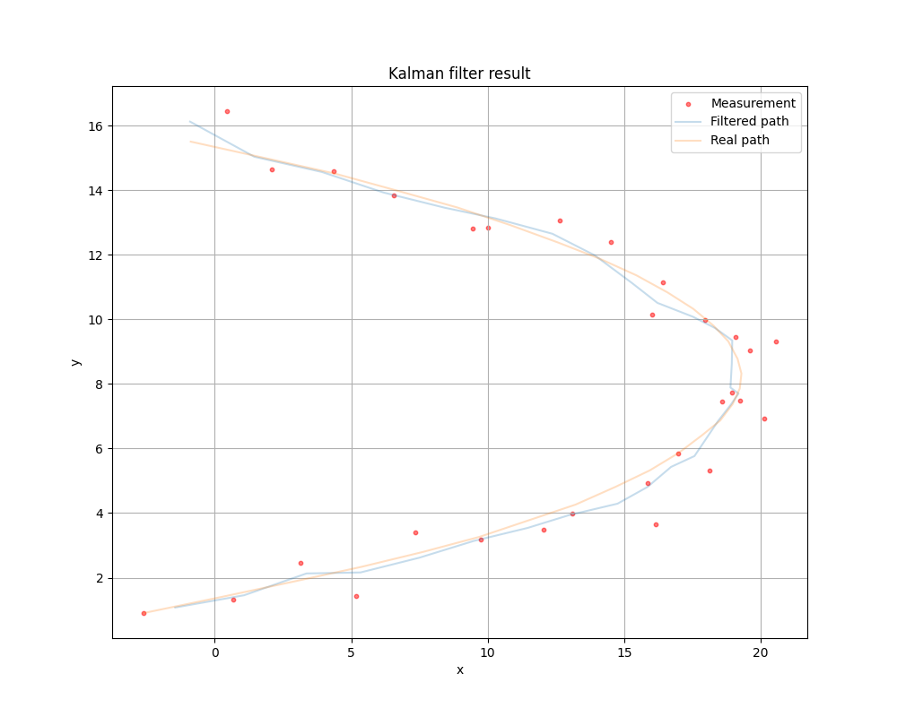
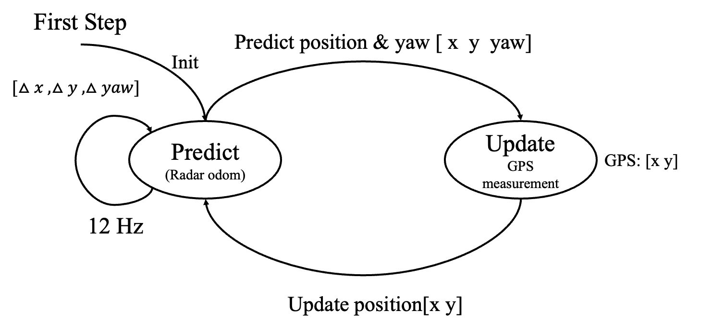
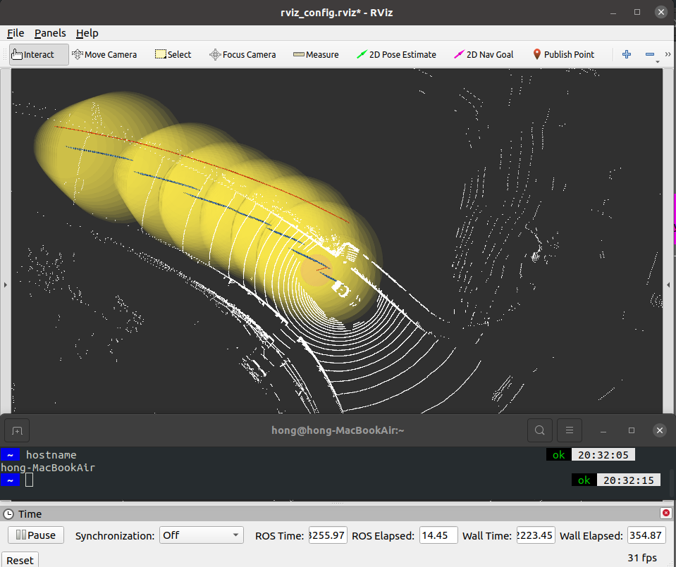
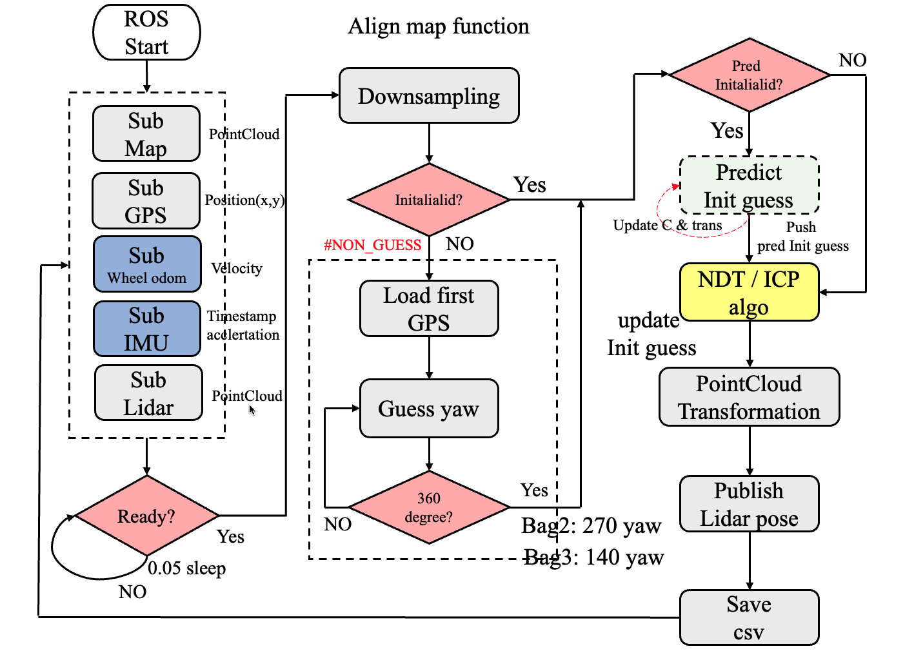

# Self-Driving-Cars
### Class project
* Kalman_filter (analysis)
* Kalman_application
* Mid Project: SLAM Localization
* Motion prediction
* Final Project: Tracking

###### Kalman_filter (Implement)

Init state

1. x 為狀態矩陣 [x y yaw] 設為 [0 0 0]
2. A為狀態轉換矩陣它將時間t-1的每個系統狀態參數的影響應用於時間t的系統狀態在這設定為I
3. $u_t$ 控制命令
4. B 為輸入控制矩陣將 $u_t$ 的控制參數影響狀態向量
5. H 為狀態向量轉換到量測向量轉換矩陣
6. Q矩陣為狀態協方矩陣和控制noisy有關,影響predict,在這控制項為3項因此為3X3矩陣
7. R矩陣為量測noisy協方矩陣,量測結果為x及y因此為2X2矩陣

```python
class Kalmanfilter():
    def __init__(self, x=0, y=0, yaw=0)
    # State (x,y,yaw)
    self.x = np.array(x,y,yaw)
    #Transition matrix
    self.A = np.idenity(3)
    self.B = np.idenity(3)
    #Error matrix
    self.P = np.idenity(3)*1
    #Observation matrix
    self.H = np.array([1,0,0],
                      [0,1,0])
    # State transition error covaraince
    self.Q = np.arrat([1,0,0],
                      [0,1,0],
                      [0,0,1])
    # Measurement error
    self.R = np.array([1,0],
                      [0,1])
    self.I = np.eye(3)
```

Predict : 基於動態方程估測下一時刻狀態, 為當前狀態加上控制向量與動態矩陣轉換下一狀態差生成下ㄧ刻狀態預測, 並計算 下一時刻 P 誤差矩陣, 之後呼叫 Update 函數進行 filter 。


```python
def predict(self, u):
    # predict next state
    self.x = self.A.dot(self.x) + self.B.dot(u)

    # P Error matrix predict
    self.P = self.A.dot(self.P).dot(self.A.T) + self.Q
```

Update:經由前一時刻預測後的狀態與當前的狀態透過 Kalman gain(K) 調整 weight 重新計算出當前新的狀態, 並更新至 x 狀 態及新的 P 協方矩陣。

```python
def update(self,z):
    # Calculate Kalman gain
    S = self.H.dot(self.P).dot(self.H.T) + self.R
    self.K = self.P.dot(self.H.T).dot(np.linalg.inv(S))

    # Calculate margin
    y = z - self.H.dot(self.x)

    # New state use kalman gain
    self.x = self.x + self.K.dot(y)

    # New P Error matrix
    KH = self.K.dot(self.H)
    I_KH = self.I - KH
    self.P = (I_KH.dot(dot.P.dot(I_KH.T)) + self.K.dot(self.R.dot(self.K.T)))
    return self.x, self.P
 ```

Result Q, R matrix design  
經分結果所設計的預測協方矩陣為 Q = [0.1, 0.05, 0; 0.05, 0.1; 0, 0, 0.1]則R=[0.75,0;0,0.75]經分析量測的 unsertainty 較大所以量測weight較小。



###### Kalman_Application real data (Implement)

實際將Kalman filter 運行實際資料在ROS上，資料中分為GPS及Radar odom，以高更新率odom最為Predict，而GPS低更新率作為Update，將兩種資料作Sensor Fusion(Kalman Filter)，獲得較精準定位資料。

Kalman filter in real data state diagram

 

Real data running in Rziz:  
經過實際調整結果在 GPS 尚能提供更精準的位置 x y 定位所以在圖中藍色斷點現象為 GPS 重新更新校正位置的結果, 而在為更新 GPS 定位下以 Radar 估測下一步狀態, 由於估測結果因誤差累積造成 P 誤差矩陣增大, 可由圖中觀測出黃色部分漸大代表誤差逐漸增加，經過下一時刻 GPS 更新後縮小但又隨時間增大, 因此在設計上來說 GPS 的誤差矩陣 R 須小於 Q 矩陣才可重新更新較精準位置



###### Mid Project : SLAM Localization

目標：實際實踐基礎SLAM定位演算法，並設計方法提升定位精準度。  
SLAM 定位流程  
1. 載入當前資料訊息在Lidar point 還沒ready前定位無法開始。
2. 當收到Lidar point 會先作downsampling，有助於提升精準度過濾outlier。
3. 而第一次定位需給定一組Init guess，但yaw並無法得知，因此以旋轉360度尋找收斂最佳值設定為初始yaw
4. 在SLAM演算法中Init guess好壞會影響matching結果，以此為了提升精準度在此加入估測方法，預測下次定位之Init guess
5. 將Init guess結果經由SLAM定位演算法(ICP/NDT)，獲得當前Init guess結果位置。
6. 將Init guess結果轉換為雲點圖pose.

(估測方法詳細於Mid_report.pdf)




實際運行結果  

[Video](https://www.youtube.com/watch?v=LX-4YiFIcFY)


###### Motion prediction
Model Design: Model 中 Baseline 參考文獻設計，建立高精地圖特徵 MapNet 使用向量化地圖建構車道圖，而文獻中以 LaneGCN 方法輸出地圖特徵，結合周遭動態特徵及車道特徵進行動態預測，而在本次車道與周圍關係 以文獻VectorNet 方法將高經地圖特徵與車道及周圍動態融合，VectorNet 將同一元素以向量組成行成一條 poyline 將多個 polylines 行成 Subgraph，將所有軌跡和地圖特徵全局分析。


(說明參考：Motion_pred_hw6.pdf)

###### Final Projection:Tracking

(說明參考：Final_projection.pdf)
# Self_Driving_Cars
